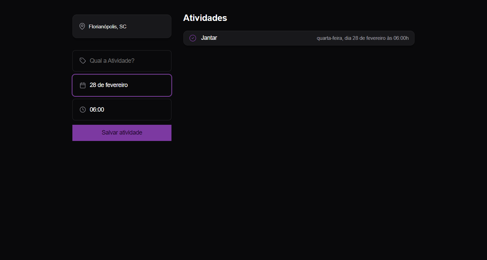

<h1 align="center"> Agenda - Journey </h1>

Programa exclusívo e gratuito, promovido pela Rocketseat para ensino de tecnologias WEB, atraves do evento NLW.

<a href="#-tecnologias">Tecnologias</a>&nbsp;&nbsp;&nbsp; |&nbsp;&nbsp;&nbsp;&nbsp;
<a href="#-projeto">Projeto</a>&nbsp;&nbsp;&nbsp;|&nbsp;&nbsp;&nbsp;
<a href="#-layout">Layout</a>&nbsp;&nbsp;&nbsp;|&nbsp;&nbsp;&nbsp;

## 🚀 Tecnologias

Esse projeto foi desenvolvido com as seguintes tecnologias:

- HTML e CSS
- JavaScript
- Git e Github
- FIGMA

## 💻 Projeto

O Agendador é um app de agenda para organizar seu dia a dia. Ele está em sua fase inicial, com o tempo irei fazer melhorias.

## 📘 Projeto feito como forma de estudos

Esse projeto foi feito como formato de estudos em colaboração com a Rocketseat, no evento NLW!

## 📚Aprendizados

Através do curso aprendi a trabalhar com as linguagens
- HTML (que é resposável por toda estrutura do site)
- CSS (Responsável por toda parte artística)
- JS (Responsável por toda inteligência do site), principalmente!
- GIT e GITHUB (Responsável por trazer todo esse projeto ao site)